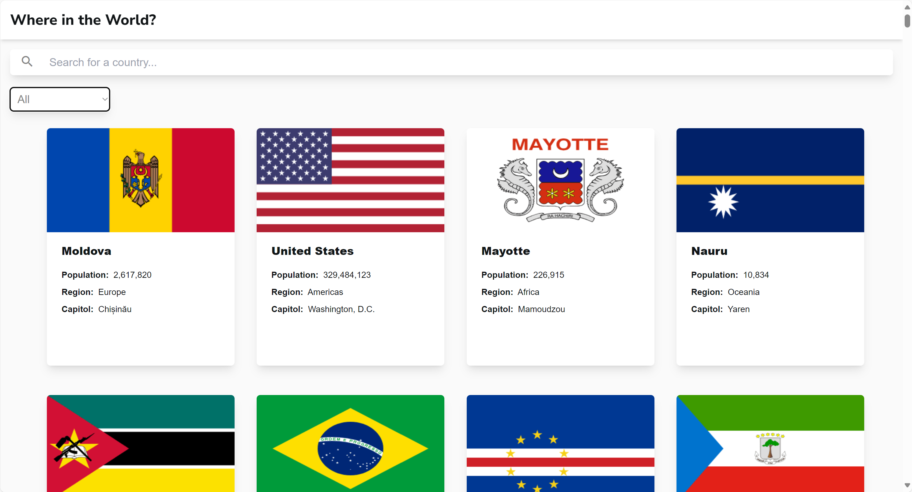

# Table of contents

- [Overview](#overview)
  - [The challenge](#the-challenge)
  - [Screenshot](#screenshot)
  - [Links](#links)
- [My process](#my-process)
  - [Built with](#built-with)
- [Author](#author)

# Overview

## The challenge

Users should be able to:

- See all countries from the API on the homepage
- Search for a country using an `input` field
- Filter countries by region
- Click on a country to see more detailed information on a separate page

## Screenshot

## Links

- Live Site URL: (https://dustin-11.github.io/Country_Api_App/)

# My process

## Built with

- Semantic HTML5 markup
- CSS custom properties
- Flexbox
- Mobile-first workflow
- Javascript
- [React](https://reactjs.org/) - JS library

# Author

- Website - [Dustin Kurtz](https://www.d-kurtz.com/)
- Frontend Mentor - [@Dustin-11](https://www.frontendmentor.io/profile/Dustin-11)
- LinkedIn - [@dustin-kurtz11](https://www.linkedin.com/in/dustin-kurtz11/)